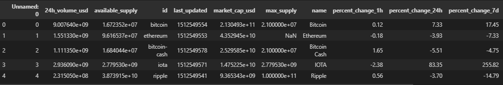
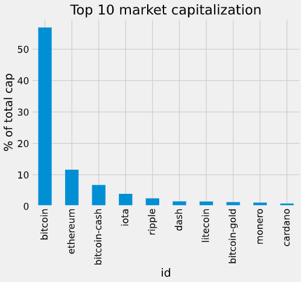
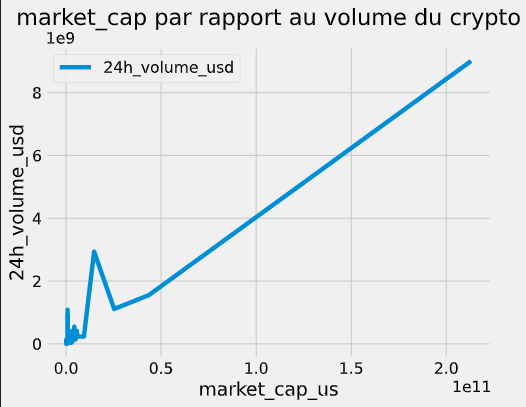

# Exploring The Bitcoin Cryptocurrency Market

- Pour mieux comprendre la croissance et l'impact de Bitcoin et d'autres crypto-monnaies, vous allez, dans ce projet, explorer la capitalisation boursière et d'autre caractéristiques de différentes crypto-monnaies existant dans le marché.

   
<em>Logo Bitcoin .</em>

- ##### vue global sur la data set : on 15 colonnes et 1326 lignes

| 
Colonne
                        |                                 
 Description
                                 |
| ----------------------------------------------------------- | :-------------------------------------------------------------------------------------------------------: |
| <strong style="color:#153462">24h_volume_usd :</strong>     |                            le nombre de fois achat et vente de crypto-monnaies                            |
| <strong style="color:#153462">available_supply :</strong>   |     nombre de jetons de crypto-monnaie qui sont accessibles au public et qui circulent sur le marché      |
| <strong style="color:#153462">id :</strong>                 |                                        l'id c'est le nom du crypto                                        |
| <strong style="color:#153462">last_updated :</strong>       |                                                                                                           |
| <strong style="color:#153462">market_cap_usd :</strong>     |                                 la valeur du crypto en bourse américaine                                  |
| <strong style="color:#153462">max_supply :</strong>         |                       nombre maximal de pièces ou de jetons qui seront jamais créés                       |
| <strong style="color:#153462">name :</strong>               |                                               Nom du crypto                                               |
| <strong style="color:#153462">percent_change_1h :</strong>  |                       la différence entre le prix actuel et le prix il y a 1 heure                        |
| <strong style="color:#153462">percent_change_24h :</strong> |                       la différence entre le prix actuel et le prix il y a 24 heure                       |
| <strong style="color:#153462">percent_change_7d :</strong>  |                     la différence entre le prix actuel et le prix il y a une semaine                      |
| <strong style="color:#153462">price_btc :</strong>          |                                               prix bitcoin                                                |
| <strong style="color:#153462">price_usd :</strong>          |                                         prix en dollar américain                                          |
| <strong style="color:#153462">rank :</strong>               |                                              rang du crypto                                               |
| <strong style="color:#153462">symbol :</strong>             |                                           Le symbole du crypto                                            |
| <strong style="color:#153462">total_supply :</strong>       | nombre de pièces ou de jetons qui existent actuellement et qui sont soit en circulation, soit verrouillés |

 

:point_right: A travers l'analyse du dataset et l'utilisation du bibliothéque matplotlib on a obtenue cette histogramme qui montre la dominance du bitcoin comme valeur en bourse par rapport aux autre crypto-monnaies.:bar_chart:

    

:point_right: A travers l'analyse du dataset et l'utilisation du bibliothéque matplotlib on a obtenue cette diagramme et on peut conclure que :Quand il y a plus de demande(24_volume_usd) pour Bitcoin, market capitalization augmente, quand il y a moins de demande, market capitalization baisse. :chart_with_upwards_trend:

:point_right: le nombre des crypto-monnaiesa augmenté mais leur part est toujours inférieure à celle du bitcoin
